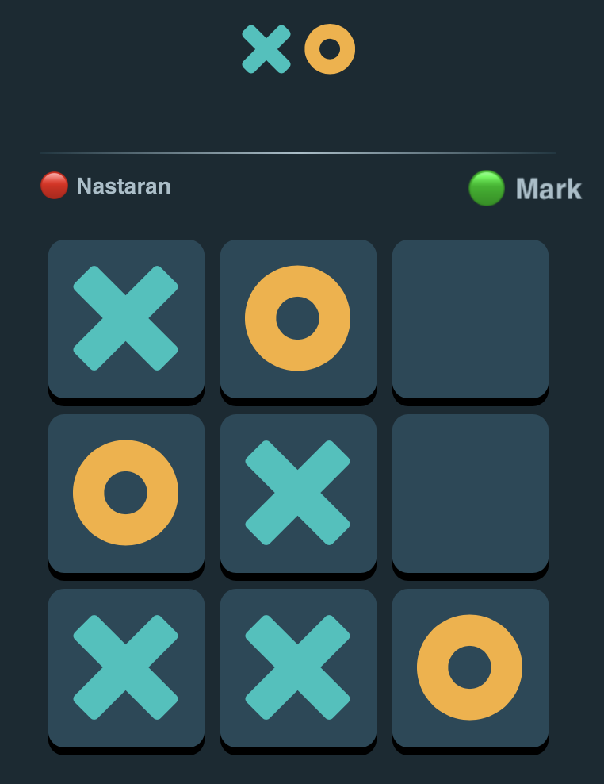

I create this live multiplayer Tic Tac Toe app using Reactjs, Nodejs, Socket.io and Framer Motion.

## Table of contents

- [Demo](#demo)
- [Specifications](#my-process)
- [Built with](#built-with)
- [How to run?](#how-to-run)

## Overview


### Demo

You can see my Tic Tac Toe online at: [Tic-Tac_Toe](https://tic-tac-toe-app.herokuapp.com)

### Specifications

- Mobile first approach
- Calculate the winner or draw and store user info in the local storage for next usage
- Handling backend and channels with Socket.io
- Managing states with React
- Implemented with React HOOKS
- Fully modular
- Adding animation and effects by Framer Motion

### Built with

- Reactjs
- Nodejs
- Socket.io
- Express
- Framer Motion
- BEM css naming convention

### How to run?

1. Start `tic-tac-toe`-application and ensure that it is running on `http://localhost:3000`
2. Run the backend

   ```bash
   cd ../server
   npm i
   npm start
   ```

### Screenshot

<!--  -->

